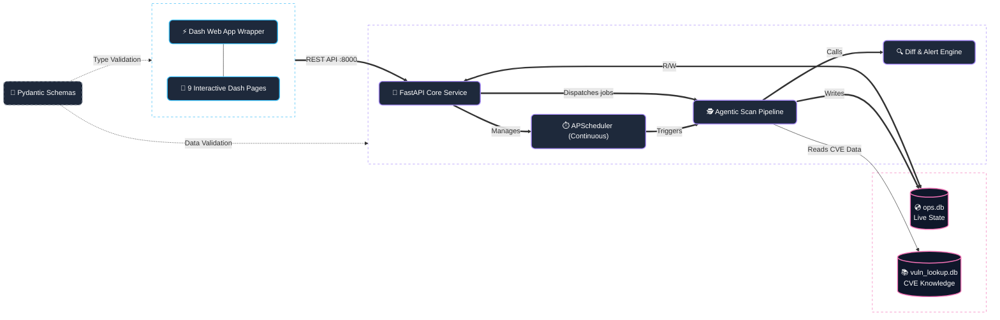
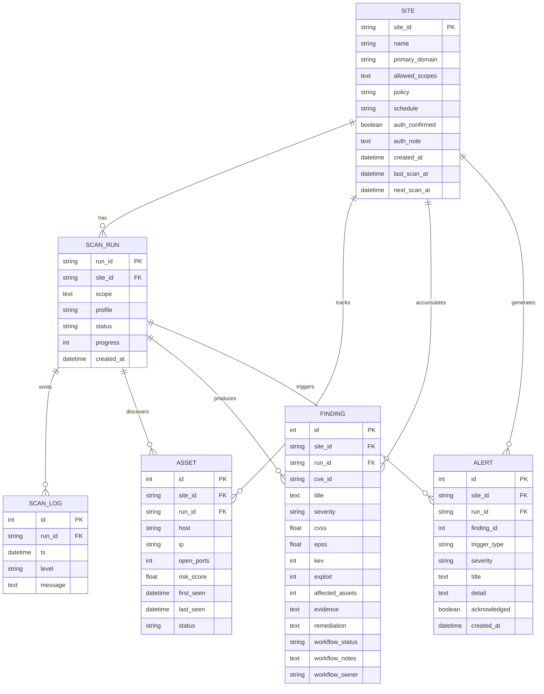
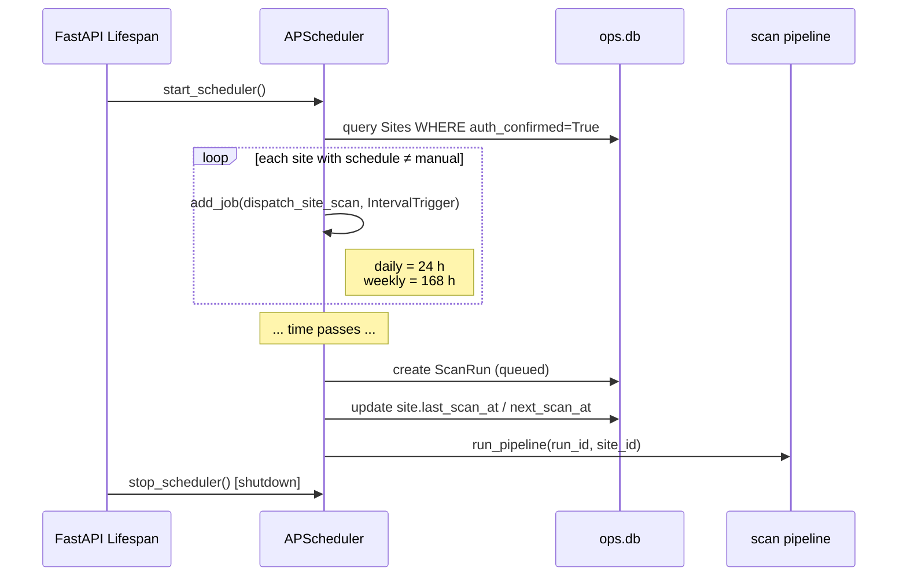
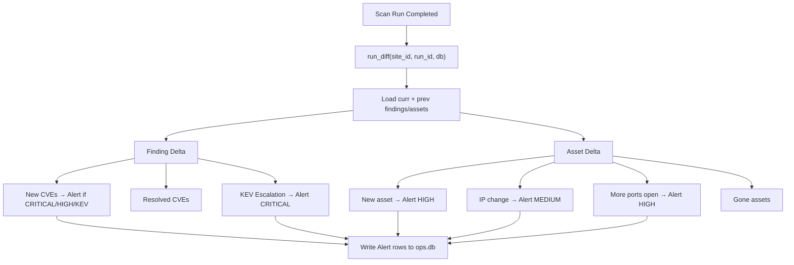
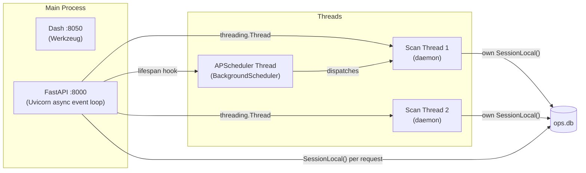
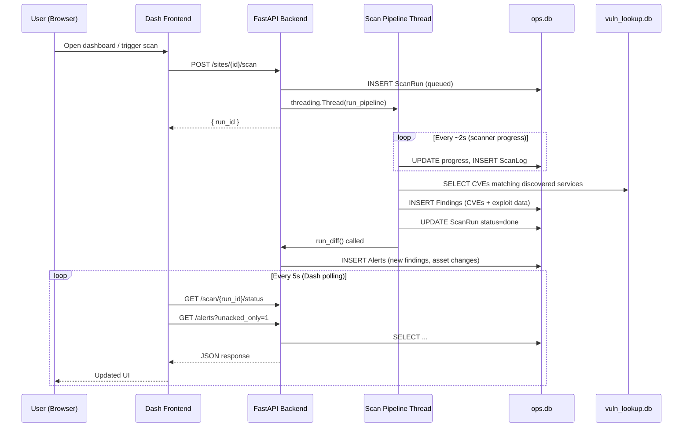

# VulnPilot — Deep System Architecture

> **VulnPilot** is a continuous, always-on **Domain Security Operations Platform** built as a capstone project. It combines an agentic multi-step scan pipeline with a real-time monitoring dashboard, a diff/change-detection engine, and an automated alerting subsystem.

---

## 1. High-Level Architecture



---

## 2. Directory Structure

```
CAPSTONE/
├── backend/
│   ├── app.py          # FastAPI routes & lifespan hooks
│   ├── db.py           # SQLAlchemy engine setup (2 DBs)
│   ├── models.py       # ORM models: Site, ScanRun, ScanLog, Asset, Finding, Alert
│   ├── scanner.py      # 6-stage agentic scan pipeline (runs in daemon thread)
│   ├── scheduler.py    # APScheduler: continuous site scanning
│   └── diff.py         # Delta engine: detects changes between scan runs
├── frontend/
│   ├── app.py          # Dash multi-page app shell + navbar
│   ├── components/
│   │   └── navbar.py   # Top navigation bar
│   └── pages/
│       ├── dashboard.py   # Command center – stats, graphs, recent runs
│       ├── sites.py       # Managed site profiles + trigger manual scan
│       ├── alerts.py      # Alert feed with acknowledge workflow
│       ├── findings.py    # CVE findings table + workflow status
│       ├── diff_view.py   # Side-by-side diff of two consecutive runs
│       ├── live_run.py    # Real-time log stream for an active run
│       ├── assets.py      # Discovered network assets
│       ├── report.py      # PDF-style vulnerability report view
│       └── new_scan.py    # Ad-hoc scan launcher
├── shared/
│   ├── __init__.py
│   └── schemas.py      # Pydantic request/response types
├── datasets/
│   ├── ops.db          # Live operational database
│   └── vuln_lookup.db  # Pre-built CVE/exploit reference database
└── setup_datasets.py   # One-time dataset builder (NVD → SQLite)
```

---

## 3. Data Model (Entity-Relationship)



### Key Design Decisions
| Decision | Rationale |
|---|---|
| Dual SQLite databases | `ops.db` keeps live operational state separate from the read-only `vuln_lookup.db` reference store |
| `site_id` on every entity | Allows per-site data scoping without complex joins |
| `workflow_status` on [Finding](file:///Users/shashankrallabandi/CAPSTONE/backend/models.py#66-85) | Implements a lifecycle: `open → acknowledged → mitigating → fixed / accepted_risk / false_positive` |
| `auth_confirmed` gate on [Site](file:///Users/shashankrallabandi/CAPSTONE/backend/models.py#8-22) | Enforces written-permission policy before any scan is dispatched |

---

## 4. Backend — FastAPI API Endpoints

### Sites

| Method | Path | Description |
|--------|------|-------------|
| `POST` | `/sites` | Register a new managed site (requires `auth_confirmed: true`) |
| `GET`  | `/sites` | List all sites with last run status, unacked alerts, and CRITICAL count |
| `POST` | `/sites/{site_id}/scan` | Trigger an immediate scan for a site |
| `GET`  | `/sites/{site_id}/diff` | Retrieve the delta between the last two completed runs |

### Scan Lifecycle

| Method | Path | Description |
|--------|------|-------------|
| `POST` | `/scan` | Start an ad-hoc scan (scope + profile) and return `run_id` |
| `GET`  | `/scan/{run_id}/status` | Poll run status and progress (0–100) |
| `GET`  | `/scan/{run_id}/logs` | Stream log entries (supports `since_id` cursor) |
| `POST` | `/scan/{run_id}/stop` | Request a graceful stop |

### Findings, Assets, Alerts

| Method | Path | Description |
|--------|------|-------------|
| `GET`  | `/runs` | Recent 50 scan runs |
| `GET`  | `/assets` | Assets, filterable by `run_id` or `site_id` |
| `GET`  | `/findings` | Findings, filterable by `run_id`, `site_id`, `severity`, `kev_only` |
| `PATCH`| `/findings/{finding_id}/workflow` | Update [status](file:///Users/shashankrallabandi/CAPSTONE/backend/app.py#237-251), `notes`, `owner` on a finding |
| `GET`  | `/alerts` | Alert feed, filterable by `site_id`, `severity`, `unacked_only` |
| `POST` | `/alerts/{alert_id}/acknowledge` | Mark an alert as acknowledged |

---

## 5. Scan Pipeline (6 Stages)

The pipeline runs in a **background daemon thread** (created per `POST /scan`), so it never blocks the API event loop.

```mermaid
flowchart LR
    classDef pre fill:#0f172a,stroke:#475569,stroke-width:2px,color:#94a3b8,rx:10px
    classDef agent fill:#1e293b,stroke:#38bdf8,stroke-width:2px,color:#fff,rx:10px
    classDef start fill:#312e81,stroke:#a78bfa,stroke-width:2px,color:#fff,rx:20px
    classDef end_state fill:#166534,stroke:#4ade80,stroke-width:2px,color:#fff,rx:20px
    classDef stop_state fill:#7f1d1d,stroke:#f87171,stroke-width:2px,color:#fff,rx:20px
    
    START(["🎯 Scan Triggered"]):::start
    
    O1["🤖 1. Orchestrator<br/><span style='font-size:10px;color:#94a3b8'>Initializes & Logs Status</span>"]:::agent
    R1["🔭 2. Recon Agent<br/><span style='font-size:10px;color:#94a3b8'>Discovers Live Hosts</span>"]:::agent
    S1["🔬 3. Scan Agent<br/><span style='font-size:10px;color:#94a3b8'>Service Detection</span>"]:::agent
    V1["🛡️ 4. Vuln Agent<br/><span style='font-size:10px;color:#94a3b8'>Maps CVEs & Exploits</span>"]:::agent
    RS1["⚖️ 5. Risk Agent<br/><span style='font-size:10px;color:#94a3b8'>CVSS & EPSS Scoring</span>"]:::agent
    RP1["📄 6. Report Agent<br/><span style='font-size:10px;color:#94a3b8'>Generates Assessment</span>"]:::agent
    
    DONE(["✅ Success: Diff Engine"]):::end_state
    HALT(["🛑 Run Stopped"]):::stop_state

    START -->|Scope + Profile| O1
    O1 -->|Discovers Hosts| R1
    R1 -->|Fingerprints| S1
    S1 -->|CPE Matching| V1
    V1 -->|Scores CVSS| RS1
    RS1 -->|Compiles| RP1
    RP1 --> DONE

    O1 -.->|Stop Requested| HALT
    R1 -.->|Stop Requested| HALT
    S1 -.->|Stop Requested| HALT
    V1 -.->|Stop Requested| HALT

    style START font-size:14px,font-weight:bold
    style DONE font-size:14px,font-weight:bold
```



### Progress Milestones

| Stage | Progress % |
|-------|-----------|
| Orchestrator start | 5 |
| Recon — discovered hosts | 25 |
| Scan Agent — services identified | 55 |
| Vuln Agent — CVE enrichment done | 80 |
| Risk scoring | 90 |
| Report generation | 95 |
| Complete | 100 |

---

## 6. Continuous Scanning — Scheduler

The **APScheduler** `BackgroundScheduler` is started inside the **FastAPI lifespan** hook (`startup`) and gracefully shut down on `shutdown`.



- [refresh_site_schedule()](file:///Users/shashankrallabandi/CAPSTONE/backend/scheduler.py#101-124) is called immediately after a site is **created or updated**, so the scheduler syncs in real-time without a restart.
- `misfire_grace_time = 3600 s` — if the server was down when a job was due, it fires within 1 hour of coming back online.

---

## 7. Diff Engine & Alerting

After every run completes, [run_diff()](file:///Users/shashankrallabandi/CAPSTONE/backend/diff.py#10-146) compares the current run against the most recent **prior** completed run for the same site. It writes [Alert](file:///Users/shashankrallabandi/CAPSTONE/backend/models.py#89-102) rows automatically.



### Alert Trigger Types

| `trigger_type` | Severity | Condition |
|---|---|---|
| `new_critical` | CRITICAL | New CRITICAL finding appeared |
| `new_kev` | CRITICAL | Finding added to CISA KEV list |
| `new_high` | HIGH | New HIGH finding appeared |
| `new_asset` | HIGH | Host not seen in previous run |
| `ip_change` | MEDIUM | IP address changed unexpectedly |
| `port_change` | HIGH | New ports opened on a host |

---

## 8. Frontend — Plotly Dash Multi-Page App

The frontend is a **server-side rendered** Dash app communicating with the FastAPI backend over HTTP REST (default: `http://localhost:8000`).

### Pages & Responsibilities

| Page | Route | Key Function |
|------|-------|-------------|
| [dashboard.py](file:///Users/shashankrallabandi/CAPSTONE/frontend/pages/dashboard.py) | `/` | Real-time stat cards, severity donut chart, risk-score bar chart, recent runs table |
| [sites.py](file:///Users/shashankrallabandi/CAPSTONE/frontend/pages/sites.py) | `/sites` | Register/manage sites, trigger manual scans, view per-site metrics |
| [alerts.py](file:///Users/shashankrallabandi/CAPSTONE/frontend/pages/alerts.py) | `/alerts` | Alert feed with severity filter, acknowledge actions |
| [findings.py](file:///Users/shashankrallabandi/CAPSTONE/frontend/pages/findings.py) | `/findings` | CVE table, filtering by severity/KEV, workflow status management |
| [diff_view.py](file:///Users/shashankrallabandi/CAPSTONE/frontend/pages/diff_view.py) | `/diff` | Side-by-side delta view of two runs (new/resolved findings + asset changes) |
| [live_run.py](file:///Users/shashankrallabandi/CAPSTONE/frontend/pages/live_run.py) | `/run/<run_id>` | Live log tail (polling), progress bar, stop button |
| [assets.py](file:///Users/shashankrallabandi/CAPSTONE/frontend/pages/assets.py) | `/assets` | Network asset inventory with risk scores |
| [report.py](file:///Users/shashankrallabandi/CAPSTONE/frontend/pages/report.py) | `/report` | Printable vulnerability assessment summary |
| [new_scan.py](file:///Users/shashankrallabandi/CAPSTONE/frontend/pages/new_scan.py) | `/new-scan` | Ad-hoc scan form (scope + profile selector) |

### Refresh Strategy

All dashboard callbacks use `dcc.Interval` (default **5 s** polling) to auto-refresh data without websockets. This keeps the architecture stateless and simple.

---

## 9. Technology Stack

| Layer | Technology | Version / Notes |
|-------|-----------|----------------|
| **API Framework** | FastAPI | Async-capable, OpenAPI auto-docs |
| **ORM** | SQLAlchemy | Declarative base, session-per-request |
| **Database** | SQLite | `ops.db` (R/W) + `vuln_lookup.db` (R/O) |
| **Task Scheduling** | APScheduler | `BackgroundScheduler` with `IntervalTrigger` |
| **Frontend** | Plotly Dash | Multi-page app with Bootstrap dark theme |
| **UI Library** | Dash Bootstrap Components | `DARKLY` theme + Bootstrap Icons |
| **Charting** | Plotly Express | Donut + horizontal bar charts |
| **Data wrangling** | Pandas | DataFrame aggregations for charts |
| **HTTP client** | requests | Frontend → Backend API calls |
| **Validation** | Pydantic | [shared/schemas.py](file:///Users/shashankrallabandi/CAPSTONE/shared/schemas.py) request/response models |
| **Vuln data** | NVD (nvdlib) + Exploit-DB | Pre-built into `vuln_lookup.db` by [setup_datasets.py](file:///Users/shashankrallabandi/CAPSTONE/setup_datasets.py) |
| **Runtime** | Python 3.x | Daemon threads for scan pipeline |

---

## 10. Concurrency Model



> [!IMPORTANT]
> Because SQLAlchemy `Session` objects are **not thread-safe**, every background thread (scanner, scheduler) creates its **own** `SessionLocal()` instance. They are **never shared** with the API request sessions.

---

## 11. Security & Authorization Model

| Control | Implementation |
|---|---|
| Scan authorization gate | `auth_confirmed: true` must be set on a [Site](file:///Users/shashankrallabandi/CAPSTONE/backend/models.py#8-22); otherwise `POST /sites/{id}/scan` returns HTTP 403 |
| CORS | Currently `allow_origins=["*"]` (suitable for local dev / capstone demo) |
| Scan profiles | `safe / balanced / aggressive` — controls scan depth/intensity |
| Workflow lifecycle | Findings must be triaged through defined states before closure |

---

## 12. Data Flow Summary


